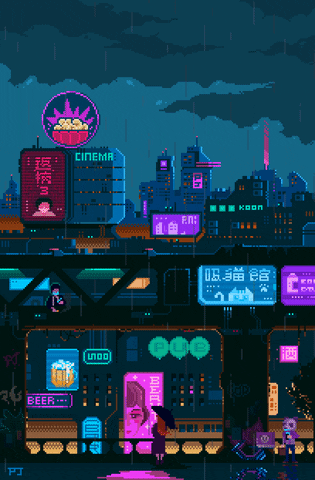

<table width="100%">
  <tr valign="top">
    <td style="padding-right: 20px;">
      
    </td>
    <td>
      <table>
        <tr>
          <td>
            
          </td>
        </tr>
        <tr>
          <td style="padding-top: 10px;">
            
          </td>
        </tr>
      </table>
    </td>
  </tr>
</table>

<picture>
  <source media="(prefers-color-scheme: dark)" srcset="github-user-contribution.svg" />
  
</picture>

